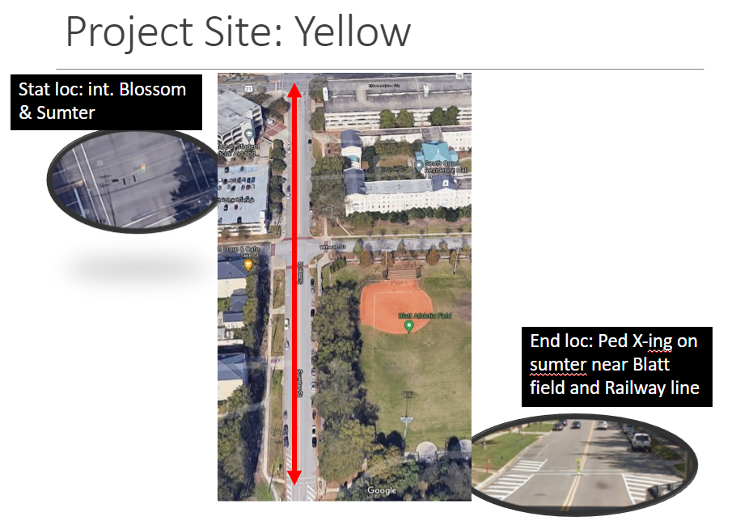
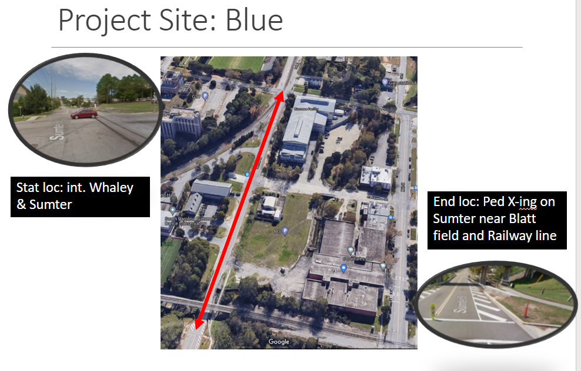
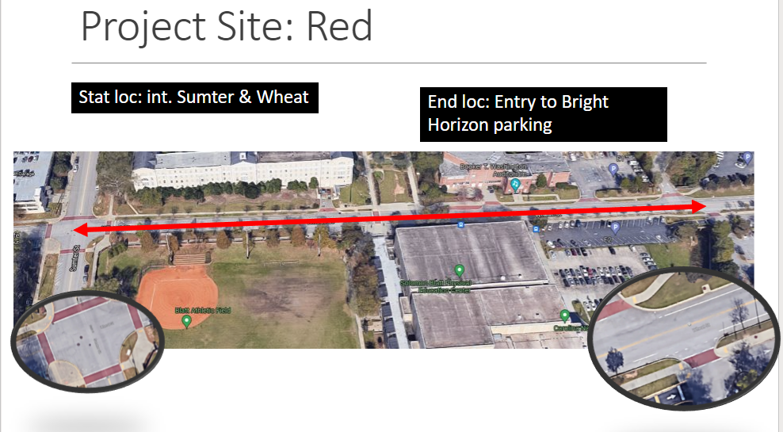

```{=html}
<style>
body {
text-align: justify}
</style>
```

# PROJECT PROBLEM STATEMENT

The ECIV 340L company has hired three surveying company to find the topography of three existing routes.  The three companies: Yellow, Blue, and Red are assigned three routes as shown in the Site Selection section.  The aim is to find elevations at **20 feet** interval along the routes. In addition, the companies are required to use **at least one turning point (TP)** along the designated routes. The BM information is provided in the Site Selection section.  The deliverables from each of these companies are:  
   
   - A final Presentation including:  
      - detail methodology of data collection
      - summary of the topography of the routes
   
   - A final report:
      - only providing a detailed engineering drawing of the profile along the route

# PROJECT TASKS:  

## 1. Reading (20%)

[Profile Leveling](https://eciv340l.netlify.app/posts/2021-10-28-profile-leveling/)


## 2. Site Selection (0%)










## 3. Data Collection and Data Analysis (50%)

  - To collect data, schedule a time to reserve equipment via email: ahmedf@email.sc.edu
    Your email should include the following information:
      - provide a list of equipment you need
      - indicate when are you going to pick up equipment
      - indicate when are you planning to do the project work
      - indicated when are you going to return the equipment
  - Prepare a data form.  The data form will be similar to lab session related to contouring

## 5. Presentation and Submission (30%)

