```{=html}
<style>
body {
text-align: justify}
</style>
```
```{r, echo=FALSE}
library(fontawesome)
```

RELATED RESOUCES:

-   `r fa(name = "fas fa-check-circle", fill = "green")` [**LECTURE SLIDES**](https://emailsc-my.sharepoint.com/:p:/g/personal/ahmedf_email_sc_edu/ERdRyWJjtnRIo8Nbb7w894wBZVB9_m6Pa_Ufl03OJawhgQ?e=vafl50)
-   `r fa(name = "fas fa-times-circle", fill = "red")` [**DEMO CALCULATION**]()
-   `r fa(name = "fas fa-check-circle", fill = "green")` [**LEVEL BOOK**](https://emailsc-my.sharepoint.com/:b:/g/personal/ahmedf_email_sc_edu/ESyiKQnHnZVCqqfCTH8MAJoBwobAMCcLoEvl_7Kj3aNHZA?e=OxD4TD)
-   `r fa(name = "fas fa-check-circle", fill = "green")` [**FIELD BOOK**](https://emailsc-my.sharepoint.com/:b:/g/personal/ahmedf_email_sc_edu/EbY8KWP9bDdAhe9G0sqjULYB6jo5q9xZEoQJAWC4ErwGMw?e=MgWRvZ)
-   `r fa(name = "fas fa-times-circle", fill = "red")` [**DATA FORM**]()
-   `r fa(name = "fas fa-check-circle", fill = "green")` [**LAB PROCEDURE (FIELD)**](https://emailsc-my.sharepoint.com/:b:/g/personal/ahmedf_email_sc_edu/EZMg12TFbe5GkGabbL3K1T0BgIA6DWKXxfmxdaLl0xvwJw?e=rFPFJD)

# Contouring

Contouring needs the determination of elevation of various points on the ground and at the same time the horizontal positions of those points should be fixed. If the total station is used both horizontal and vertical controls can be achieved from the same instrument.

# Contouring in Field

**Q: Draw contour of 98 ft and 99 ft?**

## Setup

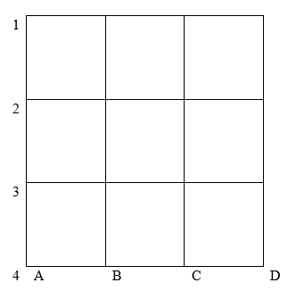

## Data Collection

|  X  |  Y  | Elevation (Z) ft |  X  |  Y  | Elevation (Z) ft |  X  |  Y  | Elevation (Z) |  X  |  Y  | Elevation (Z) |
|:---:|:---:|:----------------:|:---:|:---:|:----------------:|:---:|:---:|:-------------:|:---:|:---:|:-------------:|
|  A  |  1  |      99.50       |  B  |  1  |      97.60       |  C  |  1  |     96.25     |  D  |  1  |     94.75     |
|  A  |  2  |      97.60       |  B  |  2  |      99.25       |  C  |  2  |     98.60     |  D  |  2  |     99.65     |
|  A  |  3  |      98.75       |  B  |  3  |      99.20       |  C  |  3  |     97.75     |  D  |  3  |     99.75     |
|  A  |  4  |      100.75      |  B  |  4  |      99.60       |  C  |  4  |     99.90     |  D  |  4  |     98.20     |

# Contouring using ArcGIS

-   **Step 1:**\
    Open **ArcMap** and activate **"3D Analyst"** and **"Spatial Analyst"** extensions. Click on ***customize \> extensions*** and check two boxes like the following.

    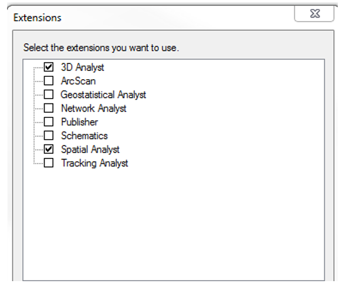

-   **Step 2:**\
    Use the data file named **"elevdemo.dbf"** (download from Blackboard). Then click on **"Catalog"** icon and go to the file location.

    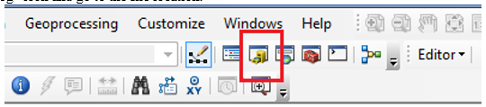

-   **Step 3:**\
    Right click on the file and choose **Create Feature Class \> From XY Table**.

    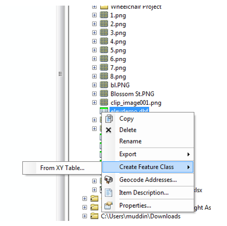

-   **Step 4:**\
    Specify the location for the output **"XYelevdemo.shp"** file. Then click **OK**.

    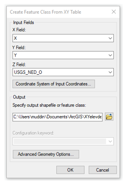

-   **Step 5:**\
    Select the data **"XYelevdemo.shp"** file and click on **"Add".** Ignore any warning.

    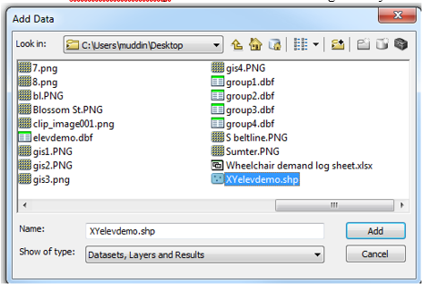

-   **Step 6:**\
    Open **ArcToolbox**; click on **Geoprocessing \> ArcToolBox**. Then go to **Create TIN (triangulated irregular network)** option. Follow the steps below.

    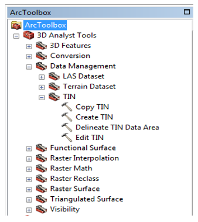

-   **Step 7:**\
    Click on **"Create TIN"** and follow the steps below and click **OK**.

    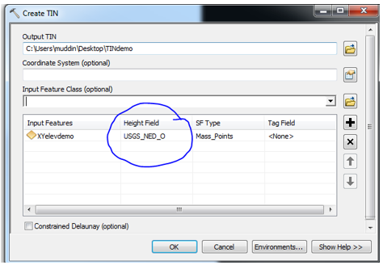

-   **Step 8:**\
    The TIN should look like the following. Export the TIN as a pdf file.

    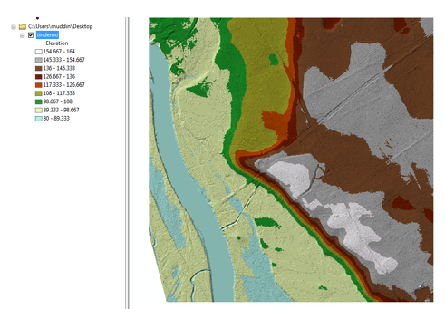

-   **Step 9:\
    **Click on **3D Analyst Tools \> Triangulated Surface \> Surface Contour**.

    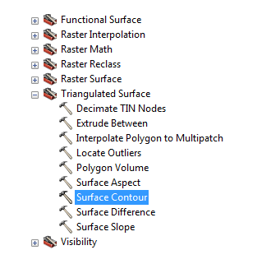

-   **Step 10:**\
    Follow the steps below and click **OK**. This step is using *5 feet* contour interval, you can choose any distance.

    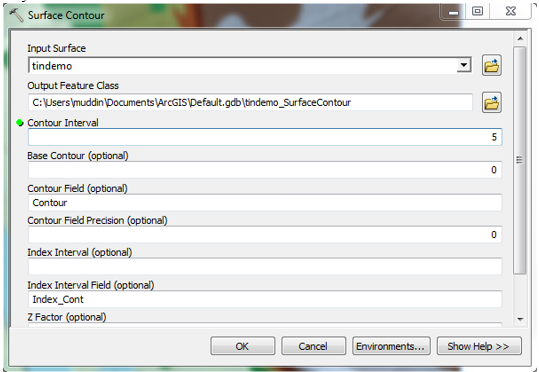

-   **Step 11:**\
    The generated contour should look like the following. Export it as a pdf file.

    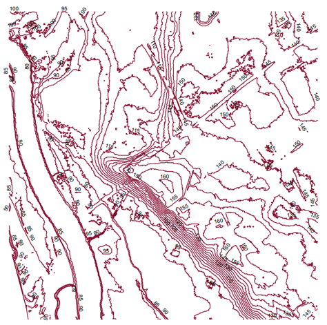

# Contouring using TransCAD

-   **Step 1:**\
    Choose **File \> Open**, then open the **"elevdemo.dbf."** Save the file as **"elevdemo.dbd."**

-   **Step 2:**\
    Choose **Tools \> 3D \> Terrian Analysis** Toolbar to display the Terrain Analysis dialog box.

-   **Step 3:**\
    Choose All Features from the Based On drop-down list, **USGS_NED_O** from the Field drop-down list, and **Feet** from the Display Units drop-down list.

-   **Step 4:**\
    Click **OK**. TransCAD displays the Terrain Analysis Toolbar.

-   **Step 5:**\
    Click on the first option in the Terrain Analysis Toolbar to activate the **Calculate Spot Data tool**, and click anywhere on the map. The estimated elevation for the point where you click is shown in the toolbox.

-   **Step 6:**\
    Click on the second option in the Terrain Analysis Toolbar to activate the **Show Profile tool,** and click on two locations on the map. TransCAD adds a line annotation to the map and creates a new figure window showing the profile along the line as an area chart.

    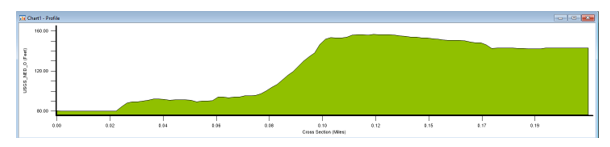

-   **Step 7:**\
    Click on "**Generate Contours**" in the Terrain Analysis Toolbar to display the Contour layer dialogue box. Follow the steps shown below.

    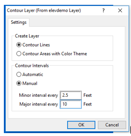

-   **Step 8:**\
    Save the Contour Layer File. Show the contour labels. Then print the contour as a pdf file.

    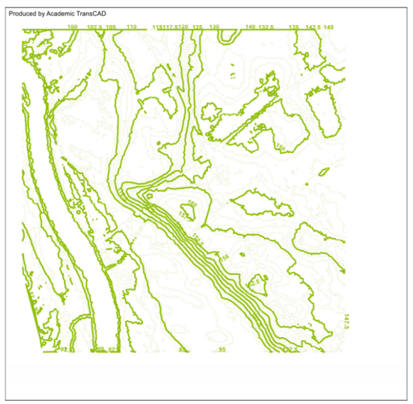

 
