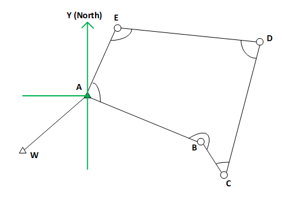

```{=html}
<style>
body {
text-align: justify}
</style>
```
```{r, echo=FALSE}
library(fontawesome)
```

RELATED RESOUCES:

-   `r fa(name = "fas fa-check-circle", fill = "green")` [**LECTURE
    SLIDES**](https://emailsc-my.sharepoint.com/:p:/g/personal/ahmedf_email_sc_edu/ETsv5Btc_jVEpsHQQzYCdjcBwzl1-wXoVvMpRCJ9TpHuXw?e=XMjC1C)
-   `r fa(name = "fas fa-check-circle", fill = "green")` [**LEVEL
    BOOK**](https://emailsc-my.sharepoint.com/:b:/g/personal/ahmedf_email_sc_edu/ESyiKQnHnZVCqqfCTH8MAJoBwobAMCcLoEvl_7Kj3aNHZA?e=OxD4TD)
-   `r fa(name = "fas fa-check-circle", fill = "green")` [**FIELD
    BOOK**](https://emailsc-my.sharepoint.com/:b:/g/personal/ahmedf_email_sc_edu/EbY8KWP9bDdAhe9G0sqjULYB6jo5q9xZEoQJAWC4ErwGMw?e=MgWRvZ)
-   `r fa(name = "fas fa-times-circle", fill = "red")` [**DATA FORM**]()
-   `r fa(name = "fas fa-check-circle", fill = "green")` [**LAB
    PROCEDURE
    (FIELD)**](https://emailsc-my.sharepoint.com/:w:/g/personal/ahmedf_email_sc_edu/EVhCUbSfnWZEuw5jzqpEwx0BgZGKl2RUWMNWfOixIfjSVg?e=mb6Yfr)
-   `r fa(name = "fas fa-times-circle", fill = "red")` [**DEMO
    CALCULATION**]()

# Total Station Introduction

In the past, transits and theodolites were the most commonly used
surveying instruments for making angle observations. These two devices
were fundamentally equivalent and could accomplish basically the same
tasks. Today, the total station instrument has replaced transits and
theodolites. Total station instruments can accomplish all of the tasks
that could be done with transits and theodolites and do them much more
efficiently. In addition, they can also observe distances accurately and
quickly. Furthermore, they can make computations with the angle and
distance observations and display the results in real time. These and
many other significant advantages have made total stations the
predominant instruments used in surveying practice today. They are used
for all types of surveys including topographic, hydrographic, and
construction surveys.


## Setting up the Total Station

### Centering

-   **Step 1.** Make sure the legs are spaced at equal intervals and the
    head is approximately level. Set the tripod so that the head is
    positioned over the survey point. Make sure the tripod shoes are
    firmly fixed.

    

-   **Step 2.** Place the instrument on the tripod head. Supporting it
    with one hand, tighten the centering screw on the bottom of the unit
    to make sure it is secured to the tripod.

    

-   **Step 3.** Looking through the optical plummet eyepiece, turn the
    optical plummet eyepiece to focus on the reticle. Turn the optical
    plummet focusing ring to focus on the survey point.

    

-   **Step 4.** Adjust the leveling foot screws to center the survey
    point in the optical plummet reticle.

    

### Leveling

-   **Step 1.** Center the bubble in the circular level by either
    shortening the tripod leg closest to the off-center direction of the
    bubble or by lengthening the tripod leg farthest from the off-center
    direction of the bubble. Adjust one more tripod leg to center the
    bubble. Turn the leveling foot screws while checking the circular
    level until the bubble is centered in the center circle.

    

-   **Step 2.** Power on the total station.

    

-   **Step 3.** Center "" in the circular level.

    

-   **Step 4.** Turn the instrument until the telescope is parallel to a
    line between leveling foot screws A and B, then tighten the
    horizontal clamp.

    

-   **Step 5.** Set the tilt angle to 0° using foot screws A and B for
    the X direction and leveling screw C for the Y direction.

-   **Step 6.** Loosen the centering screw slightly. Looking through the
    optical plummet eyepiece, slide the instrument over the tripod head
    until the survey point is exactly centered in the reticle. Retighten
    the centering screw securely.

-   **Step 7.** Confirm that the bubble is positioned at the center of
    the circular level on the screen. If not, repeat the procedure
    starting from step 5.

-   **Step 8.** When leveling is completed, press **[OK]** changes to
    the OBS mode.

### Survey Prism Offset:

−30mm (0.0984 ft)

### Azimuth:

Azimuth is defined as a horizontal angle measured clockwise from a north
base line. Azimuth has also been more generally defined as a horizontal
angle measured clockwise from any fixed reference plane or easily
established base direction line.

In the figure below, the azimuth of line AB is known to be 137° 17' 00"
from the north. The azimuth of any other line that starts at A, such as
AC in the figure, can be found directly using a total station
instrument.


### Notations:

Task 1: Distance and Angle Measurement The purpose of Task 1 is to
determine the distances of point A, B, and C from Station Z.
Additionally, the angles between ZA and ZB, ZB and ZC, and ZC and ZA
need to be determined.


## Field Work

### Task 1: Distance and Angle Measurement



### Task 2: Field Book Entry of Distance and Angle Measurement


