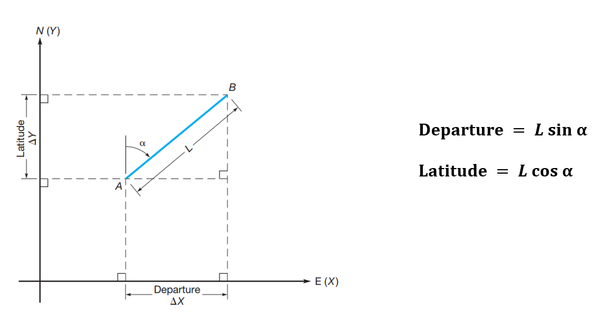

```{=html}
<style>
body {
text-align: justify}
</style>
```
```{r, echo=FALSE}
library(fontawesome)
```

RELATED RESOUCES:

-   `r fa(name = "fas fa-check-circle", fill = "green")` [**LECTURE
    SLIDES**](https://emailsc-my.sharepoint.com/:p:/g/personal/ahmedf_email_sc_edu/Ecq9kTGOKjhCmLX-jLbrgC4B3VAX3U_jYcYWHtZI9YLsmA?e=5KMzFL)
-   `r fa(name = "fas fa-check-circle", fill = "green")` [**LEVEL
    BOOK**](https://emailsc-my.sharepoint.com/:b:/g/personal/ahmedf_email_sc_edu/ESyiKQnHnZVCqqfCTH8MAJoBwobAMCcLoEvl_7Kj3aNHZA?e=OxD4TD)
-   `r fa(name = "fas fa-check-circle", fill = "green")` [**FIELD
    BOOK**](https://emailsc-my.sharepoint.com/:b:/g/personal/ahmedf_email_sc_edu/EbY8KWP9bDdAhe9G0sqjULYB6jo5q9xZEoQJAWC4ErwGMw?e=MgWRvZ)
-   `r fa(name = "fas fa-times-circle", fill = "red")` [**DATA FORM**]()
-   `r fa(name = "fas fa-check-circle", fill = "green")` [**LAB
    PROCEDURE
    (FIELD)**](https://emailsc-my.sharepoint.com/:w:/g/personal/ahmedf_email_sc_edu/EVhCUbSfnWZEuw5jzqpEwx0BgZGKl2RUWMNWfOixIfjSVg?e=mb6Yfr)
-   `r fa(name = "fas fa-check-circle", fill = "green")` [**DEMO
    CALCULATION**](https://emailsc-my.sharepoint.com/:x:/g/personal/ahmedf_email_sc_edu/EbG-dtwaahJBlDruoU9YqYcBQLic9ABFzimrbOqZ_Vn0dw?e=5telqW)

# TRAVERSING

A traverse is a series of consecutive lines whose ends have been marked
in the field and whose lengths and directions have been determined from
observations. In traditional surveying by ground methods, traversing,
the act of marking the lines, that is, establishing traverse stations
and making the necessary observations, is one of the most basic and
widely practiced means of determining the relative locations of points.
There are two kinds of traverses: closed and open. Two categories of
closed traverses exist: polygon and link. In the polygon traverse, as
shown in Fig. 1(a), the lines return to the starting point, thus forming
a closed figure that is both geometrically and mathematically closed.
Link traverses finish upon another station that should have a positional
accuracy equal to or greater than that of the starting point. The link
type (geometrically open, mathematically closed), as illustrated in Fig.
1(b), must have a closing reference direction. Closed traverses provide
checks on the observed angles and distances, which is an extremely
important consideration. They are used extensively in control,
construction, property, and topographic surveys.


An open traverse (geometrically and mathematically open) (Fig. 2)
consists of a series of lines that are connected but do not return to
the starting point or close upon a point of equal or greater order
accuracy. Open traverses should be avoided because they offer no means
of checking for observational errors and mistakes.


**Azimuths:** Azimuths are horizontal angles observed clockwise from any
reference meridian. Azimuths have also been more generally defined as a
horizontal angle measured clockwise from any fixed reference plane or
easily established base direction line.

**Bearings:** Bearings are another system for designating directions of
lines. The bearing of a line is defined as the acute horizontal angle
between a reference meridian and the line. The angle is observed from
either the north or south toward the east or west, to give a reading
smaller than 90°. The letter N or S preceding the angle, and E or W
following it shows the proper quadrant. Thus, a properly expressed
bearing includes quadrant letters and an angular value. An example is
N80°E.


**Observations of Traverse Angles:** The methods used in observing
angles or directions of traverse lines vary and include:\
(1) interior angles,\
(2) angles to the right,\
(3) deflection angles, and\
(4) azimuths.

**Traversing by Interior Angles:** Interior-angle traverses are used for
many types of work, but they are especially convenient for property
surveys. Although interior angles could be observed either clockwise or
counterclockwise, to reduce mistakes in reading, recording, and
computing, they should always be turned clockwise from the Backsight
station to the Foresight station. The procedure is illustrated in Fig.
1(a). Angle EAB of Fig. 1(a) was observed at station A, with the
Backsight on station E and the foresight at station B.

**Angle Misclosure:** The angular misclosure for an interior-angle
traverse is the difference between the sum of the observed angles and
the geometrically correct total for the polygon. The sum (Σ) of the
interior angles of a closed polygon should be


where n is the number of sides, or angles, in the polygon. The sum of
the angles in a triangle is 180°; in a rectangle, 360°; and in a
pentagon, 540°.

**Selection of Traverse Stations:** Positions selected for setting
traverse stations vary with the type of survey. In general, guidelines
to consider in choosing them include accuracy, utility, and efficiency.
Of course, intervisibility between adjacent stations, forward and back,
must be maintained for angle and distance observations. The stations
should also ideally be set in convenient locations that allow for easy
access. Ordinarily, stations are placed to create lines that are as long
as possible. This not only increases efficiency by reducing the number
of instrument setups, but it also increases accuracy in angle
observations.


## Departures and Latitudes

The departure of a course is its orthographic projection on the
east-west axis of the survey and is equal to the length of the course
multiplied by the sine of its azimuth angle. Departures are sometimes
called eastings or westings.

The latitude of a course is its orthographic projection on the
north-south axis of the survey, and is equal to the course length
multiplied by the cosine of its azimuth angle. Latitude is also called
northing or southing.



## Traverse Adjustment

For any closed traverse, the linear misclosure must be adjusted (or
distributed) throughout the traverse to "close" or "balance" the figure.
This is true even though the misclosure is negligible in plotting the
traverse at map scale. There are several elementary methods available
for traverse adjustment, but the one most commonly used is the compass
rule (Bowditch method).

**Compass (Bowditch) Rule** The compass, or Bowditch, rule adjusts the
departures and latitudes of traverse courses in proportion to their
lengths. Corrections by this method are made according to the following
rules:\


## Traversing with a Total Station (Example)

For the traverse ABCDE, the observed interior angles are given in the
table below. The fixed azimuth of line AW is 234°17'18" and the measured
angle to the right for EAW is 208°7'36". It is known that the coordinate
of point A is 10,000 Easting and 5,000 Northing. Calculate the
coordinates of point B, C, D, and E. Additionally, determine the linear
misclosure and precision.


**Error of Closure:\*** If the measured bearings and distances are
plotted on a sheet of paper, the figure will not close because of error
in latitudes (E_L) and error in departures (E_D).


## Lab Task: Traversing

The purpose of this task is to set a traverse with five stations (A, B,
C, D, and E) as presented in previous section using interior angles to
determine the angles between traverse lines. Additionally, compute the
coordinates of the points of the traverse.\
**Known Information:**\
1. The fixed azimuth of line AW is 234°17'18".\
2. The coordinate of point A is X = 5,000 Easting and Y = 7,500
Northing.
