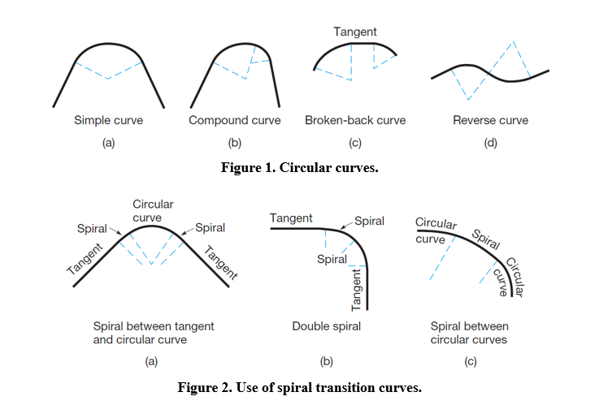
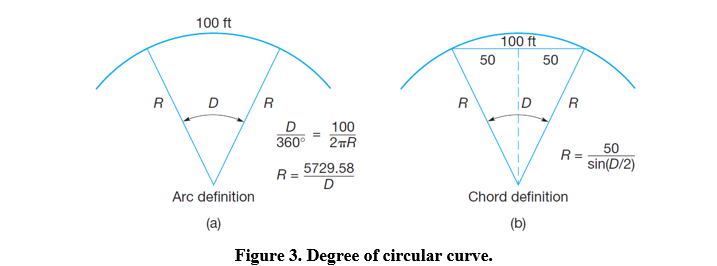
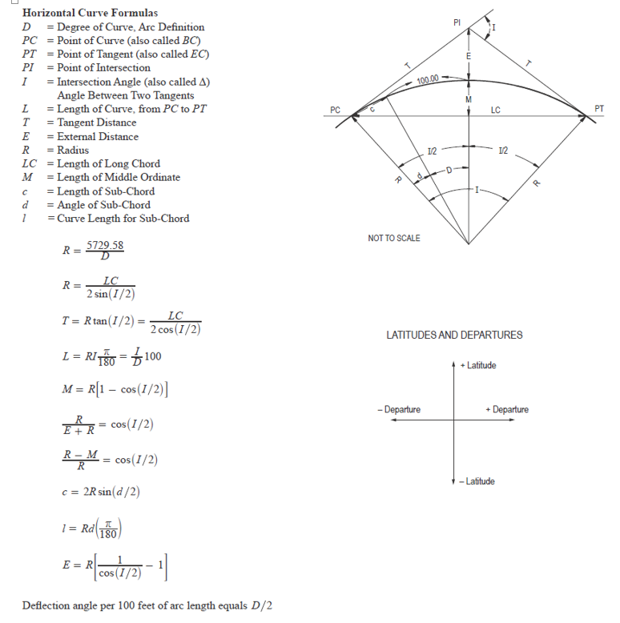
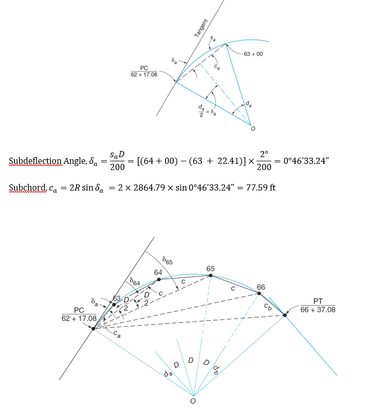
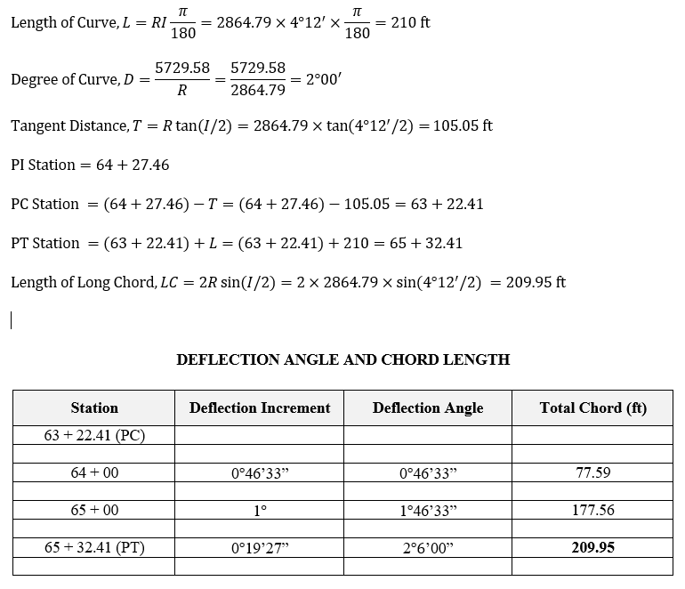
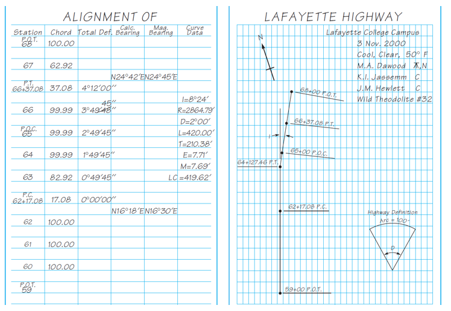
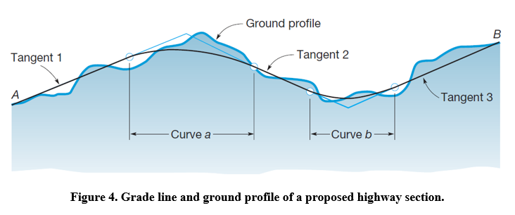
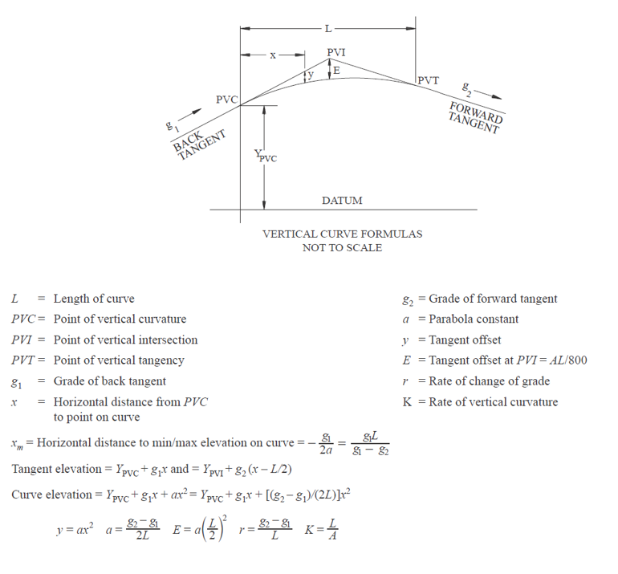
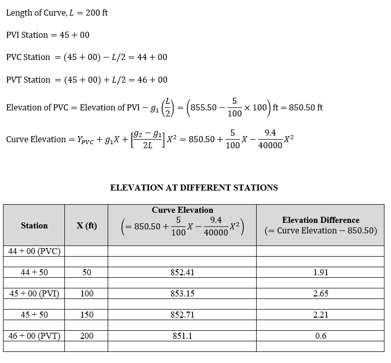

```{=html}
<style>
body {
text-align: justify}
</style>
```
```{r, echo=FALSE}
library(fontawesome)
```

RELATED RESOUCES:

-   `r fa(name = "fas fa-check-circle", fill = "green")` [**LECTURE
    SLIDES**](https://emailsc-my.sharepoint.com/:p:/g/personal/ahmedf_email_sc_edu/Ecps8JDUpfRGs7G7TopMqwsBWBmduWAXWMBzl9I_xBIJag?e=OUydzj)
-   `r fa(name = "fas fa-check-circle", fill = "green")` [**LEVEL
    BOOK**](https://emailsc-my.sharepoint.com/:b:/g/personal/ahmedf_email_sc_edu/ESyiKQnHnZVCqqfCTH8MAJoBwobAMCcLoEvl_7Kj3aNHZA?e=OxD4TD)
-   `r fa(name = "fas fa-check-circle", fill = "green")` [**FIELD
    BOOK**](https://emailsc-my.sharepoint.com/:b:/g/personal/ahmedf_email_sc_edu/EbY8KWP9bDdAhe9G0sqjULYB6jo5q9xZEoQJAWC4ErwGMw?e=MgWRvZ)
-   `r fa(name = "fas fa-times-circle", fill = "red")` [**DATA FORM**]()
-   `r fa(name = "fas fa-times-circle", fill = "red")` [**LAB PROCEDURE (FIELD)**]()
-   `r fa(name = "fas fa-check-circle", fill = "green")` [**DEMO
    CALCULATION**](https://emailsc-my.sharepoint.com/:x:/g/personal/ahmedf_email_sc_edu/ESVOtgR8A-BGnY3EA6dPTV4BMuKsKT4jRAr3a-MszbxkPA?e=KjXy1J)

# HORIZONTAL ALIGNMENT

Curves used in horizontal planes to connect two straight tangent
sections are called horizontal curves. Two types are used: circular arcs
and spirals. Both are readily laid out in the field with surveying
equipment. A simple curve (Fig. 1a) is a circular arc connecting two
tangents. It is the type most often used. A compound curve (Fig. 1b) is
composed of two or more circular arcs of different radii tangent to each
other, with their centers on the same side of the alignment. The
combination of a short length of tangent (less than 100 ft) connecting
two circular arcs that have centers on the same side (Fig. 1c) is called
a broken-back curve. A reverse curve (Fig. 1d) consists of two circular
arcs tangent to each other, with their centers on opposite sides of the
alignment. Compound, broken-back, and reverse curves are unsuitable for
modern high-speed highway, rapid transit, and railroad traffic and
should be avoided, if possible. However, they are sometimes necessary in
mountainous terrain to avoid excessive grades or very deep cuts and
fills. Compound curves are often used on exit and entrance ramps of
interstate highways and expressways, although easement curves are
generally a better choice for these situations. Easement curves are
desirable, especially for railroads and rapid transit systems, to lessen
the sudden change in curvature at the junction of a tangent and a
circular curve. A spiral makes an excellent easement curve because its
radius decreases uniformly from infinity at the tangent to that of the
curve it meets. Spirals are used to connect a tangent with a circular
curve, a tangent with a tangent (double spiral), and a circular curve
with a circular curve. Figure 2 illustrates these arrangements.



The effect of centrifugal force on a vehicle passing around a curve can
be balanced by superelevation, which raises the outer rail of a track or
outer edge of a highway pavement. Correct transition into superelevation
on a spiral increases uniformly with the distance from the beginning of
the spiral and is in inverse proportion to the radius at any point.
Properly superelevated spirals ensure smooth and safe riding with less
wear on equipment. As noted, spirals are used for railroads and
rapid-transit systems. This is because trains are constrained to follow
the tracks, and thus a smooth, safe, and comfortable ride can only be
assured with properly constructed alignments that include easement
curves. On highways, spirals are less frequently used because drivers
are able to overcome abrupt directional changes at circular curves by
steering a spiraled path as they enter and exit the curves.

## Degree of Circular Curve

The rate of curvature of circular curves can be designated either by
their radius (e.g., a 1000-ft curve) or by their degree of curve. There
are two different designations for degree of curve, the arc definition
and the chord definition. By the arc definition, degree of curve is the
central angle subtended by a circular arc of 100 ft (see Fig. 3a). This
definition is preferred for highway work. By the chord definition,
degree of curve is the angle at the center of a circular arc subtended
by a chord of 100 ft (see Fig. 3b). This definition is convenient for
very gentle curves and hence is preferred for railroads.



## Circular Curve Equations



## Circular Curve Stationing

Normally, an initial route survey consists of establishing the PIs
according to plan, laying out the tangents, and establishing continuous
stationing along them from the start of the project, through each PI, to
the end of the job. After the tangents have been staked and stationed,
the intersection angle (I) is observed at each PI and curves computed
and staked. The station locations of points on any curve are based upon
the stationing of the curve's PI. To compute the PC station, tangent
distance T is subtracted from the PI station, and to calculate the PT
station, curve length L is added to the PC station.

## Circular Curve Layout Methods

Except for unusual cases, the radii of curves on route surveys are too
large to permit swinging an arc from the curve center. Circular curves
are therefore laid out by more practical methods, including (1)
deflection angles, (2) coordinates, (3) tangent offsets, (4) chord
offsets, (5) middle ordinates, and (6) ordinates from the long chord.

## Computing Deflection Angles and Chords

To stake the first station, which is normally an odd distance from the
PC (shorter than a full-station increment), subdeflection angle δ_a and
subchord c_a are needed.



## Task 1: Circular Curve Layout with a Total Station

Assume that I=4°12', the station of the PI is 64 + 27.46, and terrain
conditions require the minimum radius permitted by the specifications to
be 2864.79 ft (arc definition). Layout the circular curve using a total
station and total chord method.



### Steps

Regardless of the method used to stake intermediate curve points, the
first steps in curve layout are:\
(1) establishing the PC and PT, normally by measuring tangent distance T
from the PI along both the back and forward tangents and\
(2) measuring the total deflection angle at the PC from PI to PT.

With the instrument set up and leveled over the PC, it is oriented by
backsighting on the PI, or on a point along the back tangent, with 0°00'
on the circle. The subdeflection angle of 0°46'33" is then turned.
Meanwhile, the 22-ft mark of the tape is held on the PC. The zero end of
the (add) tape is swung. This is station 63 + 00. Follow the same
procedure to stake other stations.

### Field Book Sample:



# VERTICAL ALIGNMENT

The vertical alignment contributes significantly to a highway's safety,
aesthetics, operations and costs. Long, gentle vertical curves provide
greater sight distances and a more pleasing appearance for the driver.
The design of vertical alignment involves, to a large extent, complying
with specific limiting criteria. These criteria include maximum and
minimum grades, sight distance at vertical curves and vertical
clearances. In addition, the designer should adhere to certain general
design principles and controls that will determine the overall safety
and operation of the facility and will enhance the aesthetic appearance
of the highway. Curves are needed to provide smooth transitions between
straight segments (tangents) of grade lines for highways and railroads.
Because these curves exist in vertical planes, they are called vertical
curves. An example is illustrated in Figure 1, which shows the profile
view of a proposed section of highway to be constructed from A to B. A
grade line consisting of three tangent sections has been designed to fit
the ground profile. Two vertical curves are needed: curve a to join
tangents 1 and 2, and curve b to connect tangents 2 and 3. The function
of each curve is to provide a gradual change in grade from the initial
(back) tangent to the grade of the second (forward) tangent. Because
parabolas provide a constant rate of change of grade, they are ideal and
almost always applied for vertical alignments used by vehicular traffic.
Two basic types of vertical curves exist, crest and sag. These are
illustrated in Figure 1. Curve a is a crest type, which by definition
undergoes a negative change in grade; that is, the curve turns downward.
Curve b is a sag type, in which the change in grade is positive and the
curve turns upward. There are several factors that must be taken into
account when designing a grade line of tangents and curves on any
highway or railroad project. They include (1) providing a good fit with
the existing ground profile, thereby minimizing the depths of cuts and
fills, (2) balancing the volume of cut material against fill, (3)
maintaining adequate drainage, (4) not exceeding maximum specified
grades, and (5) meeting fixed elevations such as intersections with
other roads. In addition, the curves must be designed to (a) fit the
grade lines they connect, (b) have lengths sufficient to meet
specifications covering a maximum rate of change of grade (which affects
the comfort of vehicle occupants), and (c) provide sufficient sight
distance for safe vehicle operation.



## Vertical Curve Equations



## Task 2: Crest Vertical Curve Layout with a Total Station

A grade g_1 of +5.00% intersects grade g_2 of -4.40% at a vertex whose
station and elevation are 45 + 00 and 855.50 ft, respectively. An
equal-tangent parabolic curve 200 ft long has been selected to join two
tangents. Layout the crest vertical curve using a total station.


