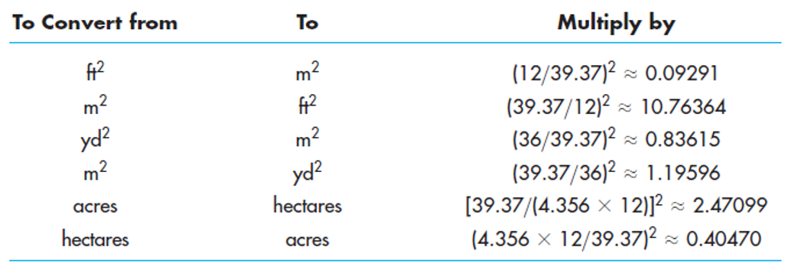
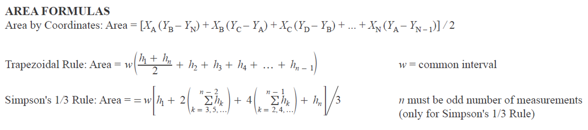
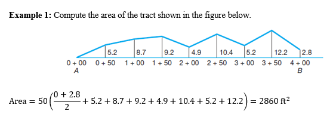
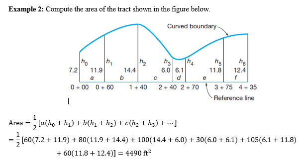
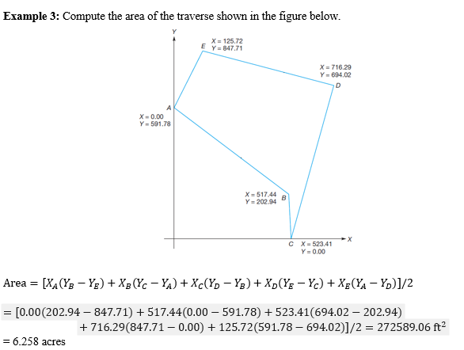
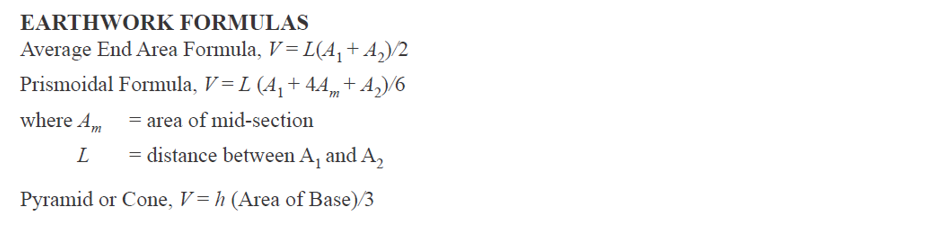
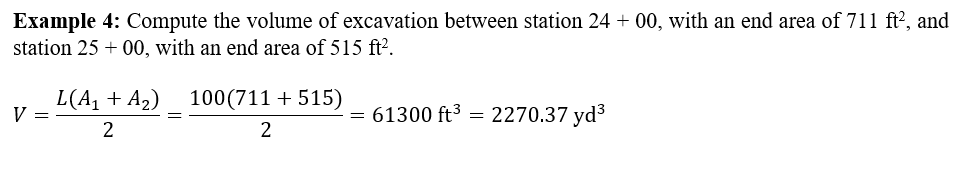
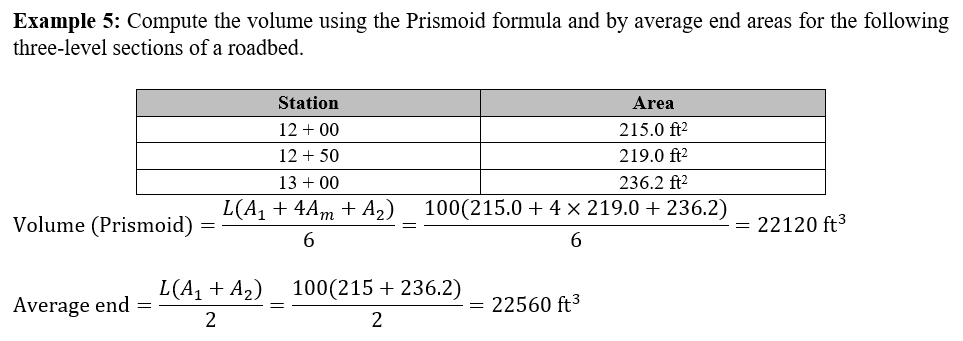
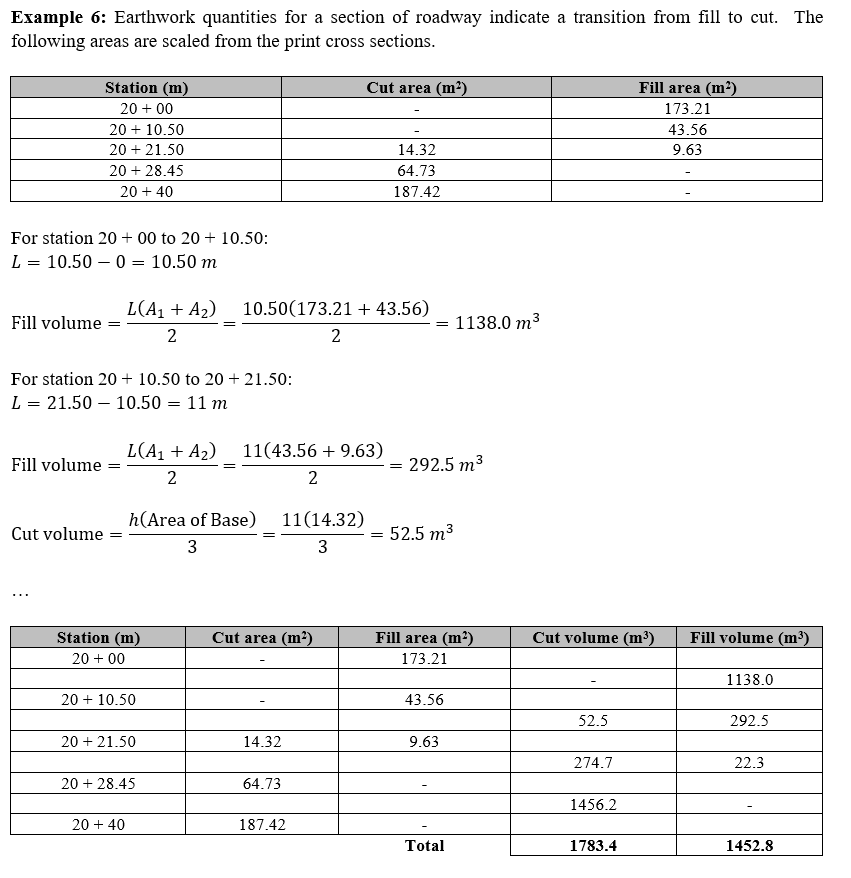
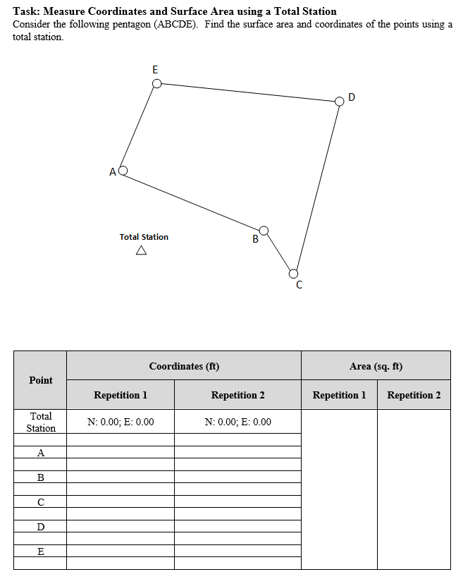

```{=html}
<style>
body {
text-align: justify}
</style>
```
```{r, echo=FALSE}
library(fontawesome)
```

RELATED RESOUCES:

-   `r fa(name = "fas fa-check-circle", fill = "green")` [**LECTURE
    SLIDES**](https://emailsc-my.sharepoint.com/:p:/g/personal/ahmedf_email_sc_edu/EaWDfOajQAxMu4ntNUywXbABHaP0QbNTcInf2afwUnEV-A?e=9wyUbk)
-   `r fa(name = "fas fa-check-circle", fill = "green")` [**LEVEL
    BOOK**](https://emailsc-my.sharepoint.com/:b:/g/personal/ahmedf_email_sc_edu/ESyiKQnHnZVCqqfCTH8MAJoBwobAMCcLoEvl_7Kj3aNHZA?e=OxD4TD)
-   `r fa(name = "fas fa-check-circle", fill = "green")` [**FIELD
    BOOK**](https://emailsc-my.sharepoint.com/:b:/g/personal/ahmedf_email_sc_edu/EbY8KWP9bDdAhe9G0sqjULYB6jo5q9xZEoQJAWC4ErwGMw?e=MgWRvZ)
-   `r fa(name = "fas fa-times-circle", fill = "red")` [**DATA FORM**]()
-   `r fa(name = "fas fa-times-circle", fill = "red")` [**LAB PROCEDURE
    (FIELD)**]()
-   ``r fa(name = "fas fa-times-circle", fill = "red")` [**DEMO
    CALCULATION**](https://emailsc-my.sharepoint.com/:x:/g/personal/ahmedf_email_sc_edu/ESVOtgR8A-BGnY3EA6dPTV4BMuKsKT4jRAr3a-MszbxkPA?e=KjXy1J)

# Surface Area

There are a number of important reasons for determining areas. One is to
include the acreage of a parcel of land in the deed describing the
property. Other purposes are to determine the acreage of fields, lakes,
etc., or the number of square yards to be surfaced, paved, seeded, or
sodded. Another important application is determining end areas for
earthwork volume calculations. In plane surveying, area is considered to
be the orthogonal projection of the surface onto a horizontal plane. In
the English system, the most commonly used units for specifying small
areas are the ft2 and yd2, and for large tracts the acre is most often
used, where 1 acre = 43,560 ft2. In the metric system, smaller areas are
usually given in m2, and for larger tracts hectares are commonly used,
where 1 hectare is equivalent to a square having sides of 100 m, and
thus equals 10,000 m2. In converting areas between the English and
metric systems, the conversion factors given below are useful.



Both field and map measurements are used to determine area. Field
measurement methods are the more accurate and include:

(1) division of the tract into simple figures (triangles, rectangles,
    and trapezoids),\

(2) offsets from a straight line,\

(3) coordinates, and\

(4) double-meridian distances.

Methods of determining area from map measurements include:

(1) counting coordinate squares,\

(2) dividing the area into triangles, rectangles, or other regular
    geometric shapes,\

(3) digitizing coordinates, and\

(4) running a planimeter over the enclosing lines.









# Earthwork (Volume)

Persons engaged in surveying (geomatics) are often called on to
determine volumes of various types of material. Quantities of earthwork
and concrete are needed, for example, on many types of construction
projects. Volume computations are also required to determine the
capacities of bins, tanks, reservoirs, and buildings, and to check
stockpiles of coal, gravel, and other materials. The most common unit of
volume is a cube having edges of unit length. Cubic feet, cubic yards,
and cubic meters are used in surveying calculations, with cubic yards
and cubic meters being most common for earthwork. Note 1 yd3 = 27 ft3; 1
m3 = 35.3144 ft3. Direct measurement of volumes is rarely made in
surveying, since it is difficult to actually apply a unit of measure to
the material involved. Instead, indirect measurements are obtained by
measuring lines and areas that have a relationship to the volume
desired. Three principal systems are used:

(1) the cross-section method,\
(2) the unit-area (or borrow-pit) method, and\
(3) the contour-area method.\









# Sample Task


