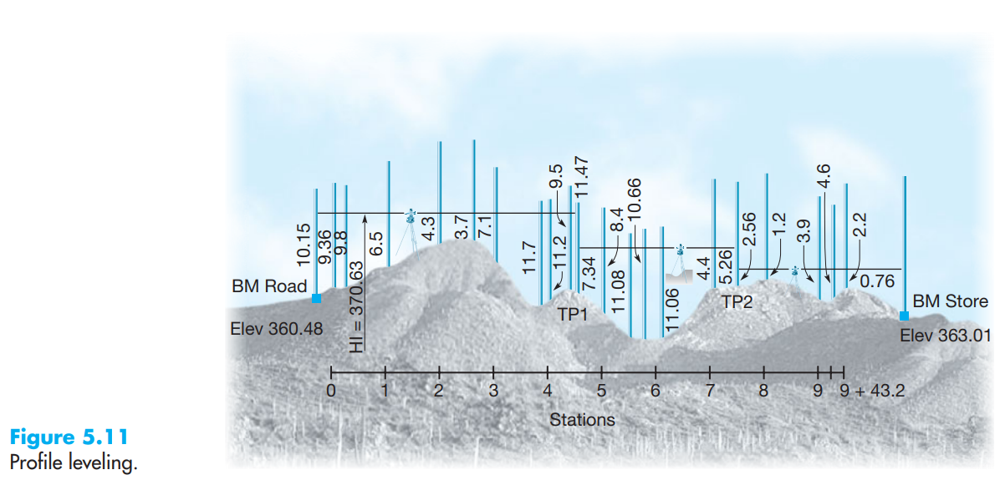
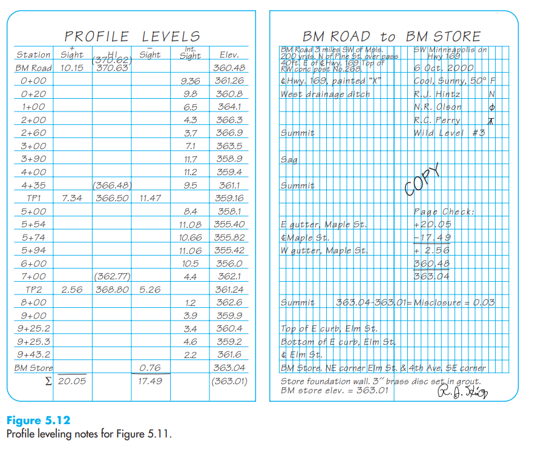
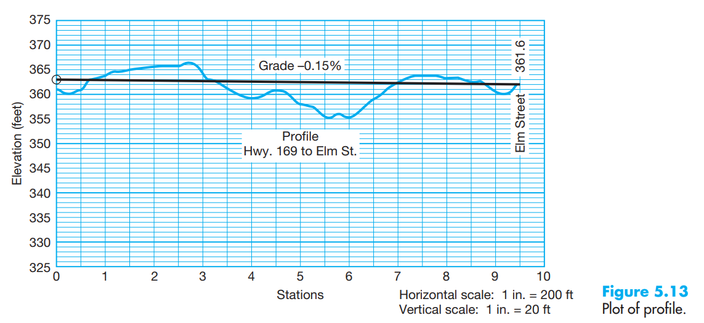

```{=html}
<style>
body {
text-align: justify}
</style>
```
```{r, echo=FALSE}
library(fontawesome)
```

# PROJECT TASKS:  

1. Reading (20%)
2. Site Selection (0%)
3. Data Collection (30%)
4. Data Analysis and Conclusion (30%)
5. Presentation and Submission (20%)


**The following excerpt was copied verbatim from the book: Elementary Surverying: An Introduction to Geomatics (13th Ed.) by CHARLES D. GHILANI and PAUL R. WOLF **

# PROFILE LEVELING

Before engineers can properly design linear facilities such as highways,
railroads, transmission lines, aqueducts, canals, sewers, and water
mains, they need accurate information about the topography along the
proposed routes. Profile leveling, which yields elevations at definite
points along a reference line, provides the needed data. The subsections
that follow discuss topics pertinent to profile leveling and include
staking and stationing the reference line, field procedures for profile
leveling, and drawing and using the profile.

## Staking and Stationing the Reference Line

Depending on the particular project, the reference line may be a single
straight segment, as in the case of a short sewer line; a series of
connected straight segments which change direction at angle points, as
with transmission lines; or straight segments joined by curves, which
occur with highways and railroads. The required alignment for any
proposed facility will normally have been selected as the result of a
preliminary design, which is usually based on a study of existing maps
and aerial photos.The reference alignment will most often be the
proposed construction centerline, although frequently offset reference
lines are used.\
To stake the proposed reference line, key points such as the starting
and ending points and angle points will be set first. Then intermediate
stakes will be placed on line, usually at 100-ft intervals if the
English system of units is used, but sometimes at closer spacing. If the
metric system is used, stakes are usually placed at 10-, 20-, 30-, or
40-m spacing, depending on conditions. Distances for staking can be
taped, or measured using the electronic distance measuring (EDM)
component of a total station instrument operating in its tracking mode
(see Sections 8.2 and 23.9).



In route surveying, a system called stationing is used to specify the
relative horizontal position of any point along the reference line.The
starting point is usually designated with some arbitrary value, for
example in the English system of units, or although can be used. If the
beginning point was a stake 100 ft along the line from it would be
designated the one 200 ft along the line etc. The term full station is
applied to each of these points set at 100-ft increments.This is the
usual increment staked in rural areas. A point located between two full
stations, say 84.90 ft beyond station would be designated Thus,
locations of intermediate points are specified by their nearest
preceding full station and their so-called plus. For station the plus is
84.90. If the metric system is used, full stations are 1 km (1000 m)
apart. The starting point of a reference line might be arbitrarily
designated as or but again could be used. In rural areas, intermediate
points are normally set at 30- or 40-m increments along the line, and
are again designated by their pluses. If the beginning point was and
stakes were being set at 40-m intervals, then etc. would be set.\
In rugged terrain and in urban situations, stakes are normally set
closer together, for example at half stations (50-ft increments) or even
quarter stations (25-ft increments) in the English system of units. In
the metric system, 20-, 10-, or even 5-m increments may be staked.
Stationing not only provides a convenient unambiguous method for
specifying positions of points along the reference line, it also gives
the distances between points. For example, in the English system
stations and are or 633.4 ft, apart, and in the metric system stations
and are 920 m apart.

## Field Procedures for Profile Leveling

Profile leveling consists simply of differential leveling with the
addition of intermediate minus sights (foresights) taken at required
points along the reference line. Figure 5.11 illustrates an example of
the field procedure, and the notes in Figure 5.12 relate to this
example. Stationing for the example is in feet. As shown in the figure,
the leveling instrument is initially set up at a convenient location and
a plus sight of 10.15 ft taken on the benchmark. Adding this to the
benchmark elevation yields a HI of 370.63 ft. Then intermediate minus
sights are taken on points along the profile at stations as etc. (If the
reference line's beginning is far removed from the benchmark,
differential levels running through several turning points may be
necessary to get the instrument into position to begin taking
intermediate minus sights on the profile line.) Notice that the note
form for profile leveling contains all the same column headings as
differential leveling, but is modified to include another column labeled
"Intermediate Sight."



When distances to intermediate sights become too long, or if terrain
variations or vegetations obstruct rod readings ahead, the leveling
instrument must be moved. Establishing a turning point, as TP1 in Figure
5.11, does this.After reading a minus sight on the turning point, the
instrument is moved ahead to a good vantage point both for reading the
backsight on the turning point, as well as to take additional rod
readings along the profile line ahead. The instrument is leveled, the
plus sight taken on TP1, the new HI computed, and further intermediate
sights taken. This procedure is repeated until the profile is completed.
Whether the stationing is in feet or meters, intermediate sights are
usually taken at all full stations. If stationing is in feet and the
survey area is in rugged terrain or in an urban area, the specifications
may require that readings also be taken at half- or even
quarter-stations. If stationing is in meters, depending on conditions,
intermediate sights may be taken at 40-, 30-, 20-, or 10-m increments.
In any case, sights are also taken at high and low points along the
alignment, as well as at changes in slope. Intermediate sights should
always be taken on "critical" points such as railroad tracks, highway
centerlines, gutters, and drainage ditches. As presented in Figure 5.12,
rod readings are normally only taken to the nearest 0.1 ft (English
system) or nearest cm (metric system) where the rod is held on the
ground, but on critical points, and for all plus and minus sights taken
on turning points and benchmarks, the readings are recorded to the
nearest hundredth of a foot (English) or the nearest mm (metric). In
profile leveling, lengths of intermediate minus sights vary, and in
general they will not equal the plus sight length. Thus errors due to an
inclined line of sight and to curvature and refraction will occur.
Because errors from these sources increase with increasing sight
lengths, on important work the instrument's condition of adjustment
should be checked (see Section 4.15), and excessively long intermediate
foresight distances should be avoided. Instrument heights (HIs) and
elevations of all turning points are computed immediately after each
plus sight and minus sight. However, elevations for intermediate minus
sights are not computed until after the circuit is closed on either the
initial benchmark or another. Then the circuit misclosure is computed,
and if acceptable, an adjustment is made and elevations of intermediate
points are calculated. The procedure is described in the following
subsection. As in differential leveling, the page check should be made
for each left-hand sheet. However in profile leveling, intermediate
minus sights play no part in this computation. As illustrated in Figure
5.12, the page check is made by adding the algebraic sum of the column
of plus sights and the column of minus sights to the beginning
elevation. This should equal the last elevation tabulated on the page
for either a turning point or the ending benchmark if that is the case,
as it is in the example of Figure 5.12.

## Drawing and Using the Profile

Prior to drawing the profile, it is first necessary to compute
elevations along the reference line from the field notes. However, this
cannot be done until an adjustment has been made to distribute any
misclosure in the level circuit. In the adjustment process, HIs are
adjusted, because they will affect computed profile elevations. The
adjustment is made progressively in proportion to the total number of
HIs in the circuit.The procedure is illustrated in Figure 5.12, where
the misclosure was 0.03 ft. Since there were three HIs, the correction
applied to each is per HI. Thus a correction of 0.01 was applied to the
first HI, ft to the second, and ft to the third. Adjusted HIs are shown
in Figure 5.12 in parentheses above their unadjusted values. It is
unnecessary to correct turning point elevations since they are of no
consequence.After adjusting the HIs, profile elevations are computed by
subtracting intermediate minus sights from their corresponding adjusted
HIs. The profile is then drawn by plotting elevations on the ordinate
versus their corresponding stations on the abscissa. By connecting
adjacent plotted points, the profile is realized. Until recently,
profiles were manually plotted, usually on special paper like the type
shown in Figure 5.13. Now with computer-aided drafting and design (CADD)
systems (see Section 18.14), it is only necessary to enter the stations
and elevations into the computer, and this special software will plot
and display the profile on the screen. Hard copies, if desired, may be
obtained from plotters interfaced with a computer.



Often these profiles are generated automatically from the CADD software
using only the alignment of the structure and an overlaying topographic
map. In drawing profiles, the vertical scale is generally exaggerated
with respect to the horizontal scale to make differences in elevation
more pronounced. A ratio of 10:1 is frequently used, but flatness or
roughness of the terrain determines the desirable proportions.Thus, for
a horizontal scale of the vertical scale might be The scale actually
employed should be plainly marked. Plotted profiles are used for many
purposes, such as (1) determining depth of cut or fill on proposed
highways, railroads, and airports; (2) studying grade-crossing problems;
and (3) investigating and selecting the most economical grade, location,
and depth for sewers, pipelines, tunnels, irrigation ditches, and other
projects. The rate of grade (or gradient or percent grade) is the rise
or fall in feet per 100 ft, or in meters per 100 m. Thus a grade of 2.5%
means a 2.5-ft difference in elevation per 100 ft horizontally.
Ascending grades are plus; descending grades, minus. A gradeline of %,
chosen to approximately equalize cuts and fills, is shown in Figure
5.13. Along this grade line, elevations drop at the rate of 0.15 ft per
100 ft. The grade begins at station where it approximately meets
existing ground at elevation 363.0 ft, and ends at station and elevation
361.6 ft where again it approximately meets existing ground. The process
of staking grades is described in Chapter 23. The term grade is also
used to denote the elevation of the finished surface on an engineering
project.
